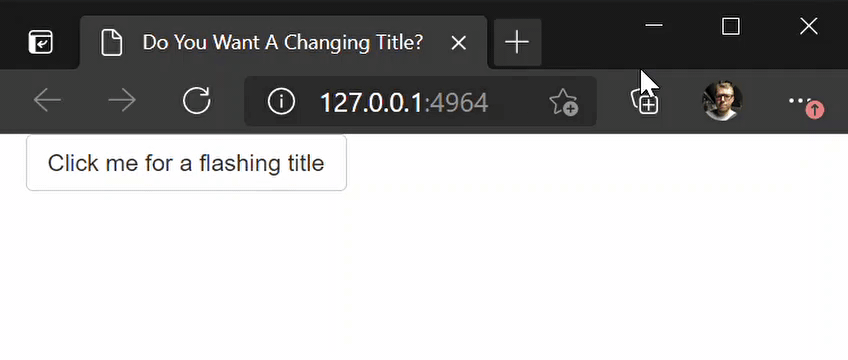

# `shinytitle` - Window Browser Title Change in Shiny

<!-- badges: start -->
[](https://github.com/ashbaldry/shinytitle/actions)
<!-- badges: end -->
  
The goal of `shinytitle` is to update the browser window title when running a shiny application.

## Installation

```r
devtools::install_github("ashbaldry/shinytitle")
```

## Functionality

Currently there are three functions:

- `change_window_title`: Make a single change to the window title
- `flashing_window_title`: Make the window title flash between the current title and a temporary second title, and
- `busy_window_title`: Adding the ability to change the browser title to a different string whenever the shiny app is busy

## Examples



### Written Example

```r
library(shiny)
library(shinytitle)
  
ui <- fluidPage(
  title = "Initial Title",
  use_shiny_title(),
  actionButton("button", "Click me for a flashing title"),
  actionButton("button2", "Click me for a new title after a 3 second wait")
)
  
server <- function(input, output, session) {
  observeEvent(input$button, {
    flashing_window_title(session, "--- Flashing Title ---", duration = 10000)
  })
    
  observeEvent(input$button2, {
    Sys.sleep(3)
    change_window_title(session, "Sleep Finished", inactive_only = TRUE)
  })
}
  
shinyApp(ui, server)
```
